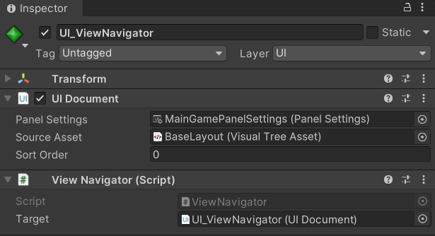
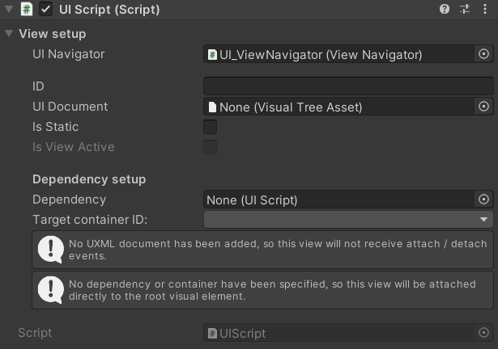

# Unity UI Toolkit Navigator

An easy to use UI framework built for Unity's UI Toolkit.

This framework was primarily designed for mostly UI based games, but it is perfect as a general UI management tool.

## Features

* __Load UI elements from UXML files onto a single UI Document on demand:__
Individual chunks of UI are organized into "Views", each acting as a separate component. Views assigned to the same `ViewNavigator` are able to call and reference each other, which allows for building complex UI.


* __Minimal setup and custom inspector:__
Setting up a View requires very little work which can be done entirely in the Editor. Simply reference a `ViewNavigator` instance, assign a unique ID to the View, attach the desired UXML file to be displayed, and finally select where it should be displayed.

* __Easy to derive custom UI scripts that integrate seamlessly:__
The base [UIView](./Documentation/UIScript.md) class (which itself builds on `Monobehaviour`) can be easily derived from, to build custom UI code that directly controls View elements.

## Setup

Installation can be done in ___Window > Packet Manager > + > Add package from git URL...___, then paste the git url of this repository (https://github.com/Xerren09/unity-ui-navigator.git), and click _Add_.

_This package requires the Unity UI Toolkit package to be installed._


## Basic usage

### Namespace
The entire library is located under the `UIViews` namespace.

### Setting up View Navigator
First, add a `UI Document`, and set up however it is needed. The source asset assigned here will act as the base frame for all future Views, and they will build into its layout.

Then, add a `ViewNavigator` component, and reference the UI Document as its Target. Done!



### Setting up a View
To set up a simple View that only loads a static piece of UI, add a `UIView` component:



|||
|---------------------|---|
| UI Navigator        | Reference the previously set up `ViewNavigator`  |
| ID                  | A ___unique___ string ID for this view. This is so it can be easily referenced later. |
| UI Document         | The UXML document containing the piece of UI that will be displayed.  |
| Is Static           | Set if the View's UI elements will not be updated. This is used internally.  |
| Dependency          | Reference another View if the current one depends on it. This will cause the referenced View to be loaded first, when the current one is displayed. (_[See dependencies](./Documentation/UIScript.md#dependency)_)  |
| Target Container Id | From the dropdown, select the name of the VisualElement that this View will load itself into. |


### Calling a View

Calling a View to be displayed only requires a reference to the controlling `ViewNavigator`:
```c#
Navigator.ShowView("ViewID");
```

Or to then hide the View:
```c#
Navigator.HideView("ViewID");
```
For more info, take a look at [the navigator's documentation.](Documentation/ViewNavigator.md)

## Custom Views

The `UIView` base class has several methods that can be used to write powerful custom UI controllers. For more info [take a look at its documentation.](Documentation/UIScript.md)

### Example
Here is an example of a simple script, for a menu bar that can be used to switch between two different game pages:

```c#
using UnityEngine.UIElements;
using UIViews;

public class BottomNavigation : UIView
{
    void Start()
    {
        // Displays the View on startup
        ShowView();
    }

    // Called when the View's contents are actually loaded and accessible
    protected override void OnEnterFocus()
    {
        // Add Button click actions
        GetViewContainer().Q<Button>("PageOneButton").clicked += SwitchToPageOne;
        GetViewContainer().Q<Button>("PageTwoButton").clicked += SwitchToPageTwo;
    }

    // Show other views

    private void SwitchToPageOne()
    {
        Navigator.ShowView("PageOne");
    }

    private void SwitchToPageTwo()
    {
        Navigator.ShowView("PageTwo");
    }
}
```

